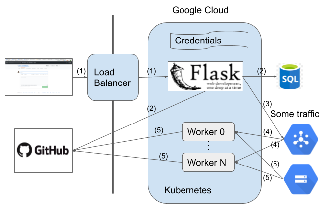

# Repo-Specific Label Microservice

There is an [issue label bot](https://mlbot.net) on GitHub, which can generate three types of labels, bug, feature and question, to new issues.
We would like to build a new label microservice that can predict repo-specific labels for different repositories.
This folder contains the service that receives an issue as input and returns repo-specific label predictions.

## Summary

We would like to integrate the whole services and there are two services now.

1. The flask app produces three types of labels, bug, feature and question, for all repositories.

1. The repo-specific label microservice (in this folder) generates repo-specific labels according to repositories.

We plan to roll out the repo-specific label microservice gradually instead of replacing the existing flask app with the new service directly.
Therefore, we would randomly select a proportion of issues from the specified repositories and send them to the new repo-specific service.

### Issue Forwarding

Currently, the flask app forwards issues from the specified repositories by random selection (see [flask\_app/app.py](https://github.com/machine-learning-apps/Issue-Label-Bot/blob/master/flask_app/app.py#L145)) with given probabilities configured in the [flask\_app/forwarded\_repo.yaml](https://github.com/machine-learning-apps/Issue-Label-Bot/blob/master/flask_app/forwarded_repo.yaml).
Therefore, to forward an issue, the issue needs to be from the repository in the list specified by the yaml file and randomly selected by the flask app.

In specific, if the value of one repository in [the yaml file](https://github.com/machine-learning-apps/Issue-Label-Bot/blob/master/flask_app/forwarded_repo.yaml) is set to `1.0`, which means the probability to forward issues is `100%`, all issues from the repo will be sent to the repo-specific label microservice.
If the value of one repository in the file is set to a lower value, there is only a small probability that issues will be processed by the label microservice.

### Architecture

The design of our rollout strategy is shown as the following diagram.

### Steps

The original bot includes step 1 and step 2.
If the flask app forwards traffic to the new service, the workers for the microservice will do repo-specific label predictions.

The following describes the steps (the numbers) in the diagram.

1. When an issue is filed, the GitHub payload will be sent to the flask app.

1. If the issue is not from the repository in [the list of repositories](https://github.com/machine-learning-apps/Issue-Label-Bot/blob/master/flask_app/forwarded_repo.yaml) or not selected by [the flask app](https://github.com/machine-learning-apps/Issue-Label-Bot/blob/master/flask_app/app.py#L145), the original bot will predict one of three types of labels and add the label to the issue.

1. If the issue is from one of the repositories and selected by the app, the flask app will forward the GitHub event to Cloud Pub/Sub and not do label predictions.

1. There is a pool of workers listening to Cloud Pub/Sub and they take one item in Cloud Pub/Sub every time.

1. Workers load the specific models from Google Cloud Storage and do repo-specific predictions.

## Project Settings

We have two services now, the flask app for the original bot and the repo-specific label microservice.
The reason why the original app and the new label microservice are running in two projects is that the authors of two services have different access to separate projects.
We may move the label microservice to the production cluster in the same project (see [issue #52](https://github.com/kubeflow/code-intelligence/issues/52)).
We also create a staging cluster to run the whole services for testing.
The following describes the GCP projects and clusters where the two services are running respectively for now.

### Production

1. The flask app
    - **repository**: [machine-learning-apps/Issue-Label-Bot](https://github.com/machine-learning-apps/Issue-Label-Bot)
    - **GCP project**: github-probots
    - **cluster**: kf-ci-ml
    - **namespace**: mlapp
    - **yaml files**: [deployment](https://github.com/machine-learning-apps/Issue-Label-Bot/tree/master/deployment)

1. Repo-specific label microservice
    - **repository**: [kubeflow/code-intelligence](https://github.com/kubeflow/code-intelligence/tree/master/Label_Microservice)
    - **GCP project**: issue-label-bot-dev (we may move to the same project as the flask app, [issue #52](https://github.com/kubeflow/code-intelligence/issues/52))
    - **cluster**: workers
    - **namespace**: default
    - **yaml files**: [Label\_Microservice/deployment](https://github.com/kubeflow/code-intelligence/tree/master/Label_Microservice/deployment)

### Testing

1. The flask app
    - **repository**: [machine-learning-apps/Issue-Label-Bot](https://github.com/machine-learning-apps/Issue-Label-Bot)
    - **GCP project**: issue-label-bot-dev
    - **cluster**: github-mlapp-test
    - **namespace**: mlapp
    - **yaml files**: [deployment](https://github.com/machine-learning-apps/Issue-Label-Bot/tree/master/deployment)

1. Repo-specific label microservice
    - **repository**: [kubeflow/code-intelligence](https://github.com/kubeflow/code-intelligence/tree/master/Label_Microservice)
    - **GCP project**: issue-label-bot-dev
    - **cluster**: github-mlapp-test
    - **namespace**: default
    - **yaml files**: [Label\_Microservice/deployment](https://github.com/kubeflow/code-intelligence/tree/master/Label_Microservice/deployment)

## Instructions

### Installation

If you would like to install the new repo-specific label microservice to your repositories, you need to follow the procedures in [the doc](./docs/onboarding_new_repositories.md).
The steps you need to finish to install the bot as the following.

1. Install the original [issue label bot](https://github.com/marketplace/issue-label-bot) to your repositories.

1. Contact the maintainers of this repository to train specific models for your repositories.

1. Set up yaml config file (e.g., [this file](https://github.com/abcdefgs0324/issue-label-bot-test/blob/master/.github/issue_label_bot.yaml)) to your repositories.

1. Tell the maintainers how much proportion of issues should be forwarded to the new label service. The maintainers will modify [the yaml file](https://github.com/machine-learning-apps/Issue-Label-Bot/blob/master/flask_app/forwarded_repo.yaml) to allow the original bot to forward issues of your repositories to the new service.

### Staging Cluster Setup

If you want to test the new code changes in the current staging cluster or create a new one, you can refer to readme files in [the original repository](https://github.com/machine-learning-apps/Issue-Label-Bot/tree/master/deployment) or [this repository](https://github.com/kubeflow/code-intelligence/tree/master/Label_Microservice/deployment) respectively. Also, you can check [the doc](./docs/set_up_staging_cluster.md) for more details to apply the bot deployments to the cluster.
The doc describes how you need to do to fulfill the following changes.

- Create a staging cluster to test the whole services.

- Re-apply the deployments while there is any code change of the original bot or the label microservice. For any code change, you may do the following steps to apply all changes.
    - Run the script to build the new docker image.
    - Add new secrets to the cluster.
    - Modify the used image and apply the new deployments.
    - Update the services in the cluster.
    - Update the ingress in the cluster.

- Integrate new microservices to the staging cluster and check the whole services work well together.
